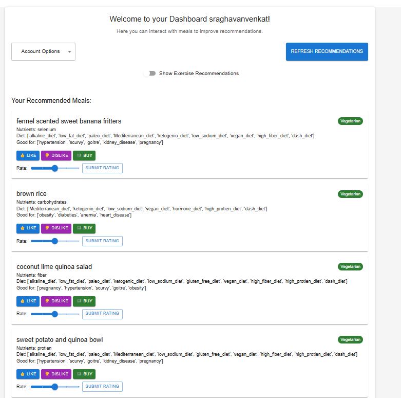
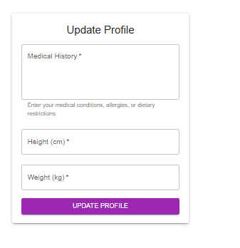

# NutriBuddy Application

**NutriBuddy** is a health and wellness application designed to parse user disease history, recommend personalized diets, and provide exercise suggestions. It uses **FastAPI** for the backend, **React** for the frontend, and **PostgreSQL** for database management, all orchestrated through **Docker Compose** for seamless containerized deployment.

---

## 🚀 Features

### 🔧 Core Functionality

1. **User Management**
   - Sign up with details like height, weight, gender, dietary preferences, and medical history.
   - Login securely with password hashing.
   - Update profile details (height, weight, disease history).
   - Change password securely.

2. **Disease Parsing & Diet Recommendations**
   - Uses an LLM (Large Language Model) service to parse disease history and recommend personalized diets.

3. **Exercise Recommendations**
   - Personalized exercises based on BMI and user preferences.
   - Randomized suggestions from categorized lists for better engagement.

4. **Interactive Dashboard**
   - View daily meal and exercise recommendations.
   - Interact with meals (like, dislike, buy).
   - Refresh recommendations on demand.

### ⚙️ Technical Stack

- FastAPI for backend REST API development.
- React for the frontend.
- PostgreSQL as the relational database.
- Docker & Docker Compose for containerization and orchestration.

---

## 🗂️ Project Directory Structure

```
nb_dev/
├── backend/               # FastAPI backend
│   └── app/
│       ├── api/           # API routes
│       ├── core/          # Configuration files
│       ├── models/        # Database models
│       ├── services/      # LLM and recommendation logic
│       └── main.py        # Entry point
├── frontend/              # React frontend
│   └── src/
│       ├── components/    # Reusable components
│       ├── pages/         # App pages
│       └── App.tsx
├── docker-compose.yml     # Docker Compose config
├── images/                # App screenshots
├── README.md              # Project documentation
```

---

## 🛠️ Setup Instructions

### Prerequisites

- Docker & Docker Compose installed
- Python 3.10+
- Node.js (for local frontend development)

### Running the Application

1. **Clone the Repository**
   ```bash
   git clone https://github.com/VenkatSR-14/nb_dev.git
   cd nb_dev
   ```

2. **Configure Environment Variables**
   Create a `.env` file inside the `backend/` folder:
   ```env
   DATABASE_URL=postgresql://postgres:password@db:5432/nutribuddy_db
   SECRET_KEY=your_secret_key_here
   ```

3. **Start Services via Docker Compose**
   ```bash
   docker-compose up --build
   ```

   - FastAPI Backend: `http://localhost:8000`
   - React Frontend: `http://localhost:3000`

4. **Access the App**
   - 🌐 Frontend: [http://localhost:3000](http://localhost:3000)
   - 🧪 API Docs: [http://localhost:8000/docs](http://localhost:8000/docs)

---

## 🧑‍💻 Using the Application

### 🔐 Login Page
Navigate to the login screen and enter your credentials.


---

### 📝 Signup Page
Fill in your details to create an account.


---

### 📊 Dashboard Page
View your recommended meals and exercises. Interact with meals and refresh suggestions.



---

### ⚙️ Update Profile Page
Update your weight, height, or medical history.



---

## 📦 Deliverables

1. **Proposal & Presentation**
   - Located in `docs/` as `.pdf` and `.pptx`.

2. **Fully Commented Code**
   - Available throughout the repo.

3. **Sample Outputs**
   - Screenshots available in `images/`.

4. **One-Page Setup Guide**
   - Provided in the README under "Setup Instructions."

5. **Discussion of Alternatives**
   - Considered alternatives like Flask and MongoDB were avoided due to performance and suitability for this use case.

6. **Incomplete Areas (If Any)**
   - Documented in the proposal (inside `docs/`).

---

## 🗃️ PostgreSQL Setup

- Configured via Docker in `docker-compose.yml`.
- Accessible with:
  ```env
  DATABASE_URL=postgresql://postgres:password@db:5432/nutribuddy_db
  ```
- Schema management via SQLAlchemy models in `backend/app/models`.

---

## 🤝 How to Contribute

1. Fork the repo.
2. Create a new feature branch.
3. Commit meaningful changes.
4. Push to your fork.
5. Open a pull request on the main repository.

---

## 🪪 License

This project is licensed under the [MIT License](https://opensource.org/licenses/MIT).
