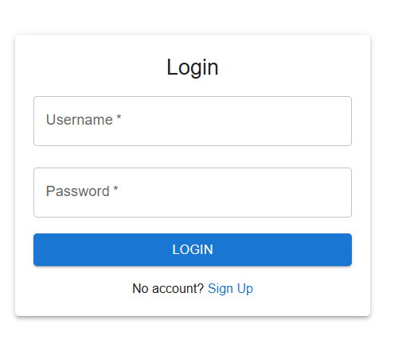
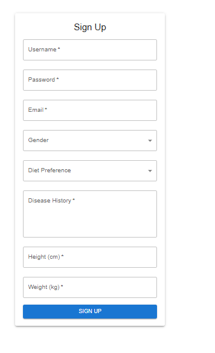

# NutriBuddy: Health & Wellness Application

NutriBuddy is a comprehensive health and wellness platform that parses user disease history, recommends personalized diets, and provides exercise suggestions. The stack includes FastAPI (backend), React (frontend), PostgreSQL (database), and Docker Compose for seamless deployment and reproducibility.

---

## 🚀 Features

- **User Management**: Secure signup, login, profile updates, and password changes
- **Disease Parsing & Diet Recommendations**: Uses LLM (Large Language Model) service for personalized diet suggestions
- **Exercise Recommendations**: Personalized and randomized exercise suggestions based on BMI and preferences
- **Interactive Dashboard**: Daily meal/exercise recommendations, meal interaction (like, dislike, buy), and refresh option
- **Fully Containerized**: All services run via Docker Compose for easy setup

---

## 🗂️ Project Structure

```
nutribuddy/
├── backend/               # FastAPI backend (app, models, API, services)
│   ├── app/
│   │   ├── api/          # API routes
│   │   ├── core/         # Configurations
│   │   ├── models/       # SQLAlchemy models
│   │   ├── services/     # LLM & recommendations
│   │   └── main.py       # Entrypoint
│   ├── requirements.txt  # Python dependencies
│   └── Dockerfile        # Backend container
├── frontend/              # React frontend
│   └── nutribuddy-client/ # React app (see below)
│       ├── src/
│       ├── public/
│       ├── package.json
│       └── Dockerfile
├── database/              # SQL schema, seeds, and migrations
├── data/                  # Datasets (CSV)
├── notebooks/             # Jupyter notebooks for EDA, modeling
├── Images/                # Screenshots & diagrams
├── Reports/               # Project reports, presentations
├── docker-compose.yml     # Orchestration for all services
├── .env                   # Environment variables (to be created)
├── README.md              # Project documentation
```

---

## 🛠️ Setup Instructions

### Prerequisites
- **Docker** & **Docker Compose** (for full-stack setup)
- **Python 3.10+** (for backend development outside Docker)
- **Node.js** (for local frontend development)

### 1. Clone the Repository
```bash
git clone https://github.com/VenkatSR-14/nb_dev.git
cd nutribuddy
```

### 2. Configure Environment Variables
Create a `.env` file in the `backend/` folder:
```env
DATABASE_URL=postgresql://postgres:password@db:5432/nutribuddy_db
SECRET_KEY=your_secret_key_here
OPENAI_API_KEY=your_openai_key_if_needed
```

### 3. Start All Services (Recommended)
Run everything with Docker Compose:
```bash
docker-compose up --build
```
- **Backend (FastAPI)**: [http://localhost:8000](http://localhost:8000)
- **Frontend (React)**: [http://localhost:3000](http://localhost:3000)
- **API Docs**: [http://localhost:8000/docs](http://localhost:8000/docs)

### 4. Manual Setup (Development Mode)
#### Backend
```bash
cd backend
pip install -r requirements.txt
uvicorn app.main:app --reload --host 0.0.0.0 --port 8000
```
#### Frontend
```bash
cd frontend/nutribuddy-client
npm install
npm start
```

---

## 🧑‍💻 Using the Application

### 🔐 Login Page


### 📝 Signup Page


### 📊 Dashboard Page


### ⚙️ Update Profile Page


---

## 📦 Deliverables
- **Proposal & Presentations**: See `Reports/`
- **Fully Commented Code**: Throughout the repo
- **Sample Outputs**: Screenshots in `Images/`
- **Setup Guide**: This README
- **Discussion of Alternatives**: See technical report and proposal
- **Incomplete Areas**: Documented in proposal (see `Reports/`)

---

## 🗃️ PostgreSQL Setup
- Managed via Docker Compose
- Schema in `database/schema.sql`, migration scripts in `database/`
- Example connection string:
  ```env
  DATABASE_URL=postgresql://postgres:password@db:5432/nutribuddy_db
  ```
- Data loaded from CSVs in `data/`

---

## ⚙️ Backend Development
- All backend code in `backend/app/`
- Install dependencies: `pip install -r requirements.txt`
- Run locally: `uvicorn app.main:app --reload`
- Main dependencies: FastAPI, SQLAlchemy, Pydantic, OpenAI, Pandas, etc.

---

## ⚛️ Frontend Development
- All React code in `frontend/nutribuddy-client/`
- Install dependencies: `npm install`
- Run locally: `npm start`
- Main dependencies: React, Material UI, Axios, React Router

---

## 🐳 Docker & Deployment
- **Build/Run all services**: `docker-compose up --build`
- **Backend Dockerfile**: `backend/Dockerfile`
- **Frontend Dockerfile**: `frontend/nutribuddy-client/Dockerfile`
- **Volumes**: Data and code are mounted for hot-reload

---

## 🤝 How to Contribute
1. Fork the repo
2. Create a feature branch
3. Commit changes
4. Push to your fork
5. Open a pull request

---

## 🪪 License
This project is licensed under the [MIT License](https://opensource.org/licenses/MIT).

---

## 📚 References
- Technical report: `NutriBuddy_Technical_Report.tex`
- EDA & modeling: `notebooks/`
- Data: `data/`
- Images: `Images/`
- Presentations: `Reports/`

---

## 💡 Notes
- For troubleshooting, see logs via Docker or run backend/frontend in development mode
- For OpenAI features, set `OPENAI_API_KEY` in your `.env`
- All images referenced are in the `Images/` folder
- For local development, you may need to adjust CORS or environment variables

---

**For any issues, please open an issue or contact the maintainers!**
